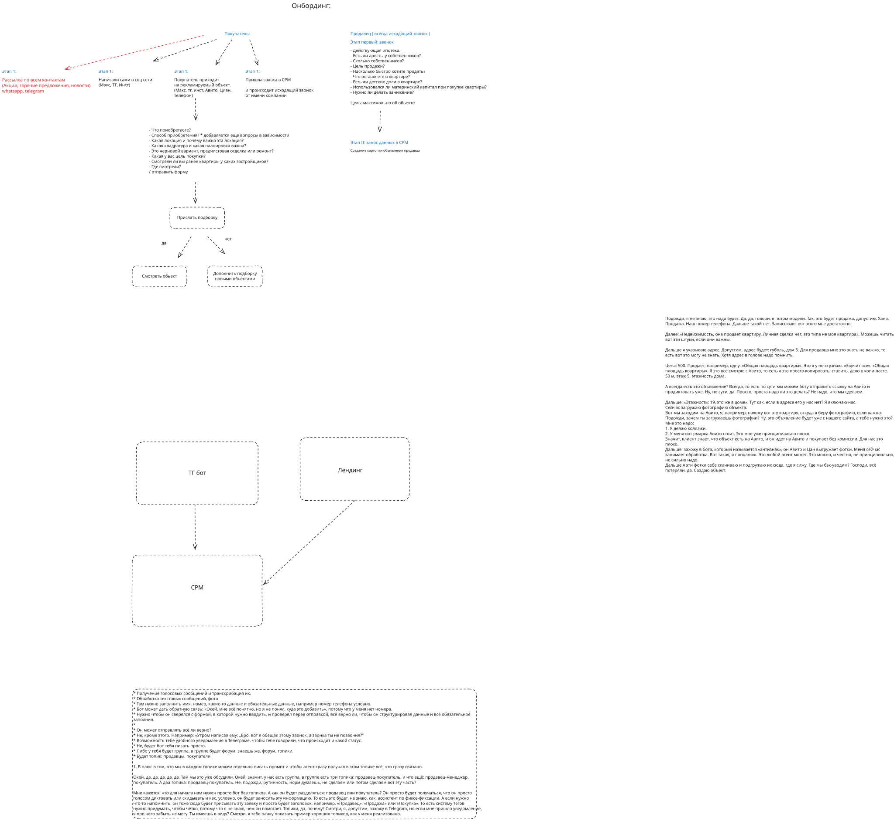

# Бриф: rieltordeals

Операционный контур агентства недвижимости: лид приходит по любому каналу → менеджер квалифицирует → система фиксирует данные → в CRM появляется карточка → дальше подборка, показ, дожим, сделка, объявление и напоминания.

Это брейншторм целиком: бот, лендинг, CRM, рассылка, фото, объявления, топики — всё часть одной картины.

Исходная схема: [onboarding.excalidraw.svg](onboarding.excalidraw.svg)



---

## Зачем это

Сейчас сделка живёт в голове менеджера, в Авито и в копипасте. После звонка данные теряются, обязательные поля не проверяются, обещанный перезвон не фиксируется. Фото тащат с площадок с водяным знаком, клиент видит объект на Авито и уходит без комиссии.

Нужен один контур, в который стекается всё:

- голос, текст, фото, ссылка на объявление;
- заявка с лендинга;
- лид с рекламы, соцсетей, площадок и рассылки;
- квалификация покупателя и продавца;
- карточка в CRM;
- подборка, показ, дожим, сделка;
- статусы и напоминания менеджеру.

Система понимает, это продажа или покупка, сверяет данные с формой карточки, не даёт отправить карточку без обязательных полей и пишет, что происходит.

---

## Кто в контуре

| Роль | Что делает |
| --- | --- |
| Менеджер | Звонит, квалифицирует, диктует и скидывает данные боту, получает статусы, напоминания, подборки и черновики карточек |
| Покупатель | Приходит с рекламы, заявки, соцсетей, площадок или рассылки. Проходит квалификацию, получает подборку, смотрит объекты |
| Продавец | Всегда исходящий звонок от компании. С него собирают максимум фактов об объекте и создают карточку объявления |
| Система | Telegram-бот, лендинг и CRM. Бот фиксирует и раскладывает данные, лендинг принимает заявку, CRM держит карточки, статусы и теги |

Каналы лида: WhatsApp, Telegram, Max, Instagram, Авито, Циан, телефон, рассылка по базе.

---

## Из чего состоит продукт

```
рассылка / соцсети / площадки / телефон
                ↓
        лендинг и заявка в CRM
                ↓
     менеджер: звонок или переписка
                ↓
            Telegram-бот
         голос · текст · фото · ссылка
                ↓
                 CRM
     карточка продавца / покупателя
                ↓
     подборка → показ → дожим → сделка
```

**Telegram-бот.** Принимает голосовые, текст и фото. Транскрибирует голос. Обрабатывает переписку. Раскладывает всё в поля формы. Сверяется с формой до отправки. Доспрашивает обязательное. Показывает черновик: всё ли верно. Пишет менеджеру, что происходит и какой статус. Напоминает про обещанный звонок. Может жить как личный чат или как группа с форум-топиками.

**Лендинг.** Заявка с объекта. Имя, телефон и остальные обязательные поля. Заявка падает в CRM, дальше исходящий звонок от имени компании.

**CRM.** Карточки продавца и покупателя, теги, исходный текст и транскрипт, фото, ссылки на объявления, обещанные звонки. В списке — миниатюра, не полная форма. Набор полей на миниатюре разный у продавца и у покупателя.

---

## Стек

Один TypeScript pnpm-монорепо. Фронт и бек не на разных языках.

| Слой | Решение |
| --- | --- |
| Язык и репо | TypeScript, pnpm-монорепо |
| Фронт | Next.js + shadcn: лендинг, CRM, карточки, подборки |
| Бек | Express: API карточек, заявок, статусов, файлов |
| Telegram | grammY: бот фиксации, статусы, напоминания, топики |
| WhatsApp | в плане после Telegram: те же карточки, Cloud API / WABA |
| Очередь и фоновые задачи | Redis: транскрибация, разложение в форму, напоминания о звонке, рассылка, выгрузка фото, парсинг объявления |

```
менеджер / клиент
        ↓
 Next.js + shadcn          Telegram (grammY)
 лендинг · CRM · формы     голос · текст · фото · ссылка
        ↓                            ↓
                 Express API
        ↓                            ↓
              Redis-очередь
     STT · поля · напоминания · фото · рассылка
        ↓
            карточка в CRM
```

Веб и бот ходят в один Express API и одну модель карточки. Тяжёлое — голос, напоминания, фото, рассылка, разбор ссылки — уходит в Redis, не крутится в запросе.

---

## Воронка покупателя

Четыре входа, все сходятся в одну квалификацию.

| Вход | Что происходит |
| --- | --- |
| Рекламируемый объект | Покупатель приходит с Max, Telegram, Instagram, Авито, Циан или телефона |
| Заявка в CRM | Исходящий звонок от имени компании |
| Сами написали в соцсети | Max, Telegram, Instagram |
| Рассылка по базе | Акции, горящие предложения, новости. WhatsApp и Telegram. Холодный контур рядом с тёплой заявкой |

Квалификация на звонке. Вопросы зависят от способа покупки — от способа открывается своя ветка.

- Что приобретаете?
- Способ приобретения? Дальше дополнительные вопросы по способу
- Какая локация и почему она важна?
- Какая квадратура и какая планировка важна?
- Черновая, предчистовая или ремонт?
- Цель покупки?
- Смотрели ли раньше квартиры, у каких застройщиков?
- Где смотрели?
- Отправить форму

После квалификации этапы той же карточки покупателя:

```
подборка → показ → дожим → сделка
```

Реферал — тоже этап той же карточки, не отдельная сущность.
Дополнить подборку — действие на этапе «подборка», не отдельный этап.
Температура холодный / тёплый / горячий — отдельное поле карточки, не этап.

---

## Воронка продавца

Продавец всегда на исходящем звонке. Цель звонка — максимум фактов об объекте.

На звонке:

- Действующая ипотека?
- Есть ли аресты у собственников?
- Сколько собственников?
- Цель продажи?
- Насколько быстро хотите продать?
- Что оставляете в квартире?
- Есть ли детские доли?
- Использовался ли материнский капитал при покупке?
- Нужно ли делать занижение?

После звонка — занос в CRM и создание карточки объявления продавца. Бот заполняет форму, сверяет обязательное, менеджер подтверждает, карточка уходит в CRM.

---

## Карточка

Форма разная для продажи и для покупки. Черновик полей собран из рабочего прохода «продажа Хана» и скриптов на схеме.

| Поле | Откуда берётся | Зачем |
| --- | --- | --- |
| Тип сделки | голос, тег | продажа / покупка |
| Тег роли | голос, кнопка, топик | продавец / покупатель |
| Телефон | голос, текст, лендинг | без телефона карточку не отправлять |
| Имя | голос, текст, лендинг | |
| Чья квартира | голос | личная сделка или чужой объект |
| Адрес | голос, объявление | держать даже если менеджер помнит сам |
| Цена | голос, объявление | |
| Комнатность | голос, объявление | |
| Общая площадь | объявление, звонок | часто копируется с Авито |
| Этаж | объявление | |
| Этажность дома | объявление | |
| Ипотека, аресты, доли, маткапитал, занижение | звонок | юридический блок продавца |
| Способ покупки, локация, метраж, отделка, цель, что смотрели | звонок | квалификация покупателя |
| Источник | лендинг, канал, голос | откуда пришёл покупатель |
| Бюджет | звонок | на миниатюре покупателя |
| Тип объекта | голос, объявление | на миниатюре продавца — «Тип» |
| Статус | менеджер | холодный / тёплый / горячий |
| Оплата | звонок | нал / ипотека |
| Этап | менеджер, бот | подборка / показ / дожим / сделка / реферал |
| ДР | голос, текст | дата рождения, на миниатюре у обеих ролей |
| Ссылка на объявление | текст | бот читает Авито и Циан и подставляет поля |
| Фото | загрузка, выгрузка с площадки | свои фото без водяного знака площадки |
| Обещанный звонок | голос, поле в форме | напоминание, если звонка не было |

Правило отправки: бот сверяет черновик с формой. Если нет обязательного поля — не пишет в CRM и говорит, чего не хватает. Пример: «мне всё понятно, но некуда это добавить — нет номера».

После сборки бот показывает структурированный черновик и спрашивает: всё верно?

Несколько сообщений подряд копятся в одну карточку, пока её не подтвердили или не открыли новую. Есть явное «новая заявка» и «это к той же».

---

## CRM

### Разделы рабочего интерфейса

Обзор `/crm` показывает ближайшие действия, ожидающих подборку покупателей и просроченные сроки.
Покупатели `/crm/buyers` и продавцы `/crm/sellers` имеют отдельные списки с поиском, сортировкой, фильтрами и добавлением карточки нужной роли.
Разделы «Заявки» и «Объекты» из навигации CRM убраны.
Входящая заявка остаётся входом в ту же карточку покупателя, а данные объекта остаются в карточке продавца.

Подборки `/crm/selections` показывают покупателей на этапе «подборка»: кому подбираем, бюджет, запрос, локацию и статус ожидания.
Текущие варианты и комментарии менеджер дополняет в той же карточке покупателя.
Горячие, тёплые и холодные доступны как фильтры температуры, независимо от этапа.
Показы `/crm/viewings` и сделки `/crm/deals` показывают карточки на соответствующих этапах без отдельной модели сделки и дополнительных подэтапов.

Задачи `/crm/tasks` связаны с карточкой клиента и имеют тип, название, подробности, срок и отметку выполнения.
Типы: подобрать варианты, организовать показ, подать на ипотеку, позвонить и другая задача.
Выполнение задачи не переводит клиента на следующий этап автоматически.
Напоминания `/crm/reminders` показывают обещанные звонки и задачи со сроком, включая просроченные.
Отправка уведомлений в Telegram требует отдельного подключения бота и Redis-воркера; список сроков в CRM работает независимо от доставки.

Списки покупателей и продавцов показывают миниатюру, не всю форму.
По клику открывается полная карточка той же модели.
Одна миниатюра на обе роли не подходит.

**Миниатюра продавца**

| Поле |
| --- |
| Имя |
| Тип |
| Адрес |
| Телефон |
| ДР |

**Миниатюра покупателя**

| Поле | Значения |
| --- | --- |
| Имя | |
| Телефон | |
| Источник | канал лида |
| Бюджет | |
| Тип объекта | |
| Статус | холодный / тёплый / горячий |
| Оплата | нал / ипотека |
| Этап | подборка / показ / дожим / сделка / реферал |
| ДР | |

Температура и этап — два поля одной карточки, не две воронки.

---

## Telegram-бот

Бот — ассистент фиксации и операционный канал менеджера.

**Вход.** Голосовые с транскрибацией, текст, фото. Менеджер диктует после звонка, кидает ссылку на Авито, загружает фото, дописывает поля. Бот может ответить: понял всё, кроме того, куда это положить.

**Классификация.** Теги `Продавец`, `Покупатель`, `Продажа`, `Покупка`. От тега строятся заголовок карточки, уведомление и форма. Можно ставить голосом, кнопкой или тем, в какой топик написали.

**Сверка с формой.** Отдельная форма продавца и покупателя. Недостающее доспрашивает. Лишнее не выбрасывает молча: говорит, что понял, и спрашивает поле.

**Подтверждение.** Перед записью в CRM — карточка целиком, отправить или поправить.

**Напоминания.** Если менеджер пообещал звонок и не позвонил, бот пишет ему. Пример: «бро, вот я обещал этому звонок, а ты не позвонил». Обещание можно снять с диктовки или поставить полем «перезвонить до».

**Статусы.** Бот сам пишет, что происходит: карточка собрана, не хватает полей, ушла в CRM, ушла подборка, назначен показ, этап сменился, висит обещанный звонок.

**Доставка уведомлений.** Личный чат с менеджером или группа. В группе — форум с топиками. В каждом топике свой промпт, агент сразу получает только связанный контур.

Топики на схеме:

- продавцы
- покупатели
- продавец–менеджер

Плюс топиков: всё, что связано с продавцами, не смешивается с покупателями, и промпт топика сразу задаёт роль агента.

---

## Фото и объявления

Почти всегда у объекта уже есть объявление на Авито или Циан. Менеджер кидает боту ссылку и договаривает то, чего в объявлении нет. Бот подставляет площадь, этаж, этажность, цену, комнатность, адрес.

Фото с площадки брать как есть нельзя: водяной знак Авито показывает клиенту, что объект лежит на Авито, и он уходит без комиссии. Поэтому контур фото такой:

1. ссылка на объявление или ручная загрузка;
2. выгрузка фото без водяного знака (сейчас это делают через «антизнак»);
3. коллажи для своего объявления;
4. загрузка в карточку объекта в CRM и на свой сайт.

Свой сайт и своё объявление — чтобы клиент вёл сделку через агентство, а не через площадку.

---

## Рассылка

Отдельный вход в воронку покупателя: рассылка по всем контактам — акции, горящие предложения, новости. WhatsApp и Telegram. Ответ на рассылку попадает в ту же квалификацию и ту же карточку покупателя.

---

## Как это сходится

Менеджер после звонка или переписки кидает в бота голос, текст, фото или ссылку. Бот транскрибирует, раскладывает по форме продавца или покупателя, доспрашивает обязательное, показывает черновик. После подтверждения в CRM есть карточка с полями, тегом, исходным текстом или транскриптом, фото и статусом.

Дальше по покупателю карточка идёт по этапам: подборка → показ → дожим → сделка, либо реферал. Дополнить подборку можно на этапе «подборка». По продавцу собирается карточка объявления: юридический блок, адрес, цена, метраж, фото без чужого водяного знака.

Менеджер в Telegram видит, что происходит, и не забывает обещанный звонок. Если удобнее группа — топики режут поток на продавцов и покупателей, и у каждого топика свой промпт.
