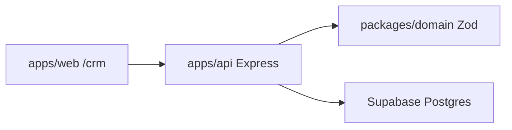

# Базовый срез: domain, Supabase, API, CRM

Стек не меняем: TypeScript, Express, Next.js, Supabase без Drizzle, веб ходит только в API. Бота и worker не заводим. Логина нет.

Источник продукта: [BRIEF.md](../../BRIEF.md). Стек: [STACK.md](../STACK.md). Правила: [AGENTS.md](../../AGENTS.md).

## Решения среза

- Менеджер создаёт карточку из CRM, правит поля и меняет температуру и этап.
- В БД нельзя записать карточку без телефона, роли и типа сделки. Остальные поля дописываются потом.
- На карточке есть исходный текст и «перезвонить до». Фото и Redis не делаем.
- Auth не подключаем. API пишет в Supabase service role.
- Локальный Supabase через CLI (`supabase init` + `supabase start`), не облако и не self-host на VPS в этом срезе.

Температура (`холодный` / `тёплый` / `горячий`) и этап (`подборка` / `показ` / `дожим` / `сделка` / `реферал`) — два поля одной карточки. Не смешивать. Реферал — этап той же карточки. Дополнить подборку — действие на этапе «подборка», не отдельный этап.



## 1. `packages/domain`

Новый пакет, не пустой: схемы, температура, этапы, правило записи.

- Роль: `seller` | `buyer`. Тип сделки: `sale` | `purchase`.
- Теги `Продавец` / `Покупатель` / `Продажа` / `Покупка` считаются из роли и типа, отдельной таблицы нет.
- Температура: `cold` | `warm` | `hot`.
- Этапы покупателя: `selection` → `viewing` → `close` → `deal`. Плюс `referral` — этап той же карточки.
- Продавец после записи — карточка объявления, без воронки покупателя.
- Zod-формы продавца и покупателя по полям из BRIEF: адрес, цена, комнатность, площадь, этаж, этажность, чья квартира, ссылка, источник, бюджет, тип объекта, оплата, ДР, юридический блок / квалификация. Фото в схему не кладём.
- `assertCanPersistCard`: телефон + роль + тип сделки. Полная сверка обязательных полей формы — позже, в боте.
- Стартовые значения: покупатель — этап `selection`; продавец без этапа покупателя. Температуру при создании можно не ставить.

## 2. Инициализация Supabase

В корне репозитория нет `supabase/`.

- `supabase init` → `supabase/config.toml`.
- Миграция `supabase/migrations/` с одной таблицей `cards`.

Колонки записи и списка (миниатюра читает колонки, не всю форму):

```sql
id uuid pk default gen_random_uuid()
role text not null check (seller|buyer)
deal_type text not null check (sale|purchase)
phone text not null
name text
object_type text
address text
source text
budget text
temperature text check (cold|warm|hot)
payment text check (cash|mortgage)
stage text check (selection|viewing|close|deal|referral)
birthday date
source_text text
promised_call_at timestamptz
fields jsonb not null default '{}'
created_at timestamptz not null default now()
updated_at timestamptz not null default now()
```

- RLS включить, политик для anon не давать: CRM не ходит в Postgres напрямую.
- `supabase start` (нужен Docker): Studio + локальные ключи.
- В `.env.example`: `SUPABASE_URL`, `SUPABASE_SERVICE_ROLE_KEY`. В `apps/web` ключи Supabase не класть.
- В `README.md`: `supabase start`, затем `pnpm dev`.

`apps/api` получает `@supabase/supabase-js` и пишет только через service role.

## 3. `apps/api`

Роуты уже висят в `apps/api/src/app.ts`. Реализуем карточки, остальное не трогаем.

- `GET /cards` — список миниатюр, фильтры `role`, `temperature`, `stage`.
- `GET /cards/:id` — полная карточка той же модели.
- `POST /cards` — 400 без телефона/роли/типа; `fields` гоняется через Zod формы роли.
- `PATCH /cards/:id` — поля формы, температура, этап (этап только у покупателя и только из enum), `source_text`, `promised_call_at`, колонки миниатюры.
- `GET /statuses` — температура и этапы из domain, не из БД.
- `POST /leads` и `POST /files` остаются 501.
- Тесты: health как сейчас; отказ `POST /cards` без телефона; успешное создание минимальной карточки. Supabase в тесте мокаем. Не требовать облачный проект.

## 4. CRM в `apps/web`

Лендинг `/` не трогаем. shadcn нет — ставим в `apps/web` по стеку.

Список `/crm` — миниатюра, не полная форма. Одна сетка колонок на обе роли не подходит.

- Продавец: имя, тип, адрес, телефон, ДР.
- Покупатель: имя, телефон, источник, бюджет, тип объекта, температура, оплата, этап, ДР.

Ещё на списке: «перезвонить до», фильтр по роли / температуре / этапу, кнопка «Новая карточка».

- `/crm/cards/new` — форма создания: роль, тип сделки, телефон, имя, исходный текст, перезвонить до, поля формы выбранной роли, температура и этап у покупателя.
- `/crm/cards/[id]` — полная карточка, правка, смена температуры и этапа, сохранение.
- Клиент только `apps/web/src/lib/api.ts` → Express. Прямых вызовов Supabase из Next нет.

## 5. Что не входит

`apps/bot`, `apps/worker`, логин, фото, парсинг Авито/Циан, `POST /leads`, назначение менеджера.

Порядок в AGENTS («сначала бот») для этого среза сдвигаем: domain → Supabase → запись в API → CRM. Бот следующим пакетом пишет в те же `/cards` и ту же таблицу.

## Порядок работы

1. `packages/domain`: схемы продавца/покупателя, температура, этапы, `assertCanPersistCard`.
2. `supabase init`, миграция `cards`, `.env.example`, README, клиент в API.
3. Express `GET/POST/PATCH /cards` и `GET /statuses` + тесты валидации.
4. shadcn, `/crm` миниатюры, `/crm/cards/new`, `/crm/cards/[id]` через `api()`.
